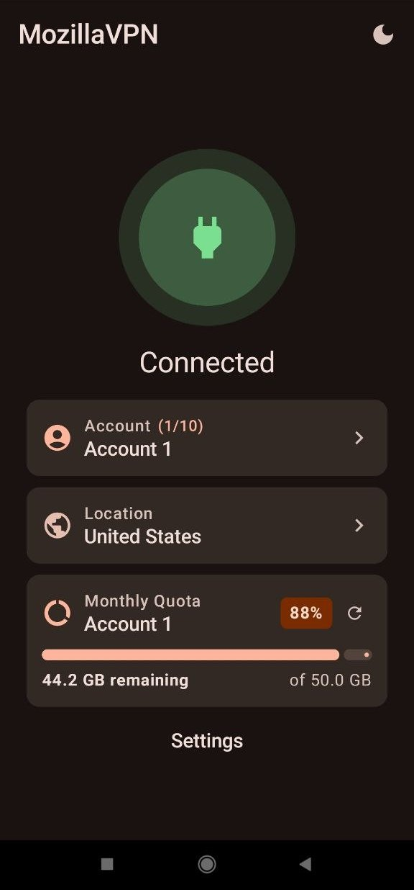

# FoxyVPN

### از ایمیل اصلی خودتون استفاده نکنید ⚠️❌

کلاینت پیشرفته، امن و با کارایی بالا برای اندروید بر پایه پروتکل تانل نیتیو SOCKS5/HTTP2 و احراز هویت سرویس‌های موزیلا و گاردین، بازطراحی‌شده با معماری چند اکانته و رابط کاربری مدرن Jetpack Compose.

---

### ۱. معرفی و نمای کلی پروژه
این پروژه یک کلاینت اختصاصی VPN برای سیستم‌عامل اندروید است که ترافیک لایه شبکه (IP Layer) را با استفاده از موتور نیتیو تانل به بسته‌های TCP/UDP تبدیل نموده و از طریق تانل مالتی‌پلکس‌شده امن HTTP/2 و SOCKS5 به سرورهای لبه (Edge Nodes) هدایت می‌کند.

در نسخه‌ اخیر، هسته برنامه و معماری سرویس به صورت اساسی بازطراحی شده است تا چالش محدودیت سهمیه ترافیک (Quota Limit)، قطع اتصال‌های مکرر و مدیریت حساب‌های کاربری را با رویکردی مدرن و خودکار برطرف سازد.

---

### ۲. تغییرات کلیدی و قابلیت‌های جدید پیاده‌سازی‌شده

#### ۲.۱. سیستم مدیریت چند اکانته (Multi-Account Pool - تا ۱۰ اکانت)
* **استخر حساب‌های کاربری (Account Pool):** امکان ذخیره و مدیریت همزمان تا **۱۰ حساب کاربری مستقل**.
* **سوییچ بلادرنگ و بدون قطعی (Seamless Hot-Switching):** تغییر حساب کاربری فعال بدون قطع شدن ترافیک VPN، بدون بسته شدن اینترفیس TUN و بدون از دست رفتن لوکیشن، سرور و تنظیمات انتخاب‌شده. سرویس از طریق اینتنت `ACTION_SWITCH_ACCOUNT` توکن‌های Upstream را به صورت On-the-Fly جابه‌جا می‌کند.
* **سوییچ خودکار هوشمند (Auto-Failover on Quota Limit):** در صورت دریافت خطای محدودیت سهمیه (`QuotaExceededError` یا خطاهای ۴۲۹ / محدودیت گاردین)، سیستم به شکل خودکار اکانت جاری را به عنوان محدودشده علامت‌گذاری کرده و بدون نیاز به دخالت کاربر، به اکانت معتبر بعدی در استخر سوییچ می‌کند.

#### ۲.۲. صفحه اختصاصی و امن ساخت اکانت رایگان فایرفاکس (In-App Signup)
* **ثبت‌نام مستقیم و امن درون برنامه:** اضافه شدن صفحه اختصاصی `RegisterScreen` متصل مستقیم به `accounts.firefox.com/signup` به صورت کاملاً امن با مسدودسازی خطاهای SSL و جلوگیری از حملات MITM.
* **جداسازی نشست‌ها برای همه ۱۰ اکانت** 
* **دکمه انتقال سریع به لاگین** 

#### ۲.۳. نوار پیشرفت مصرف ترافیک (Traffic Quota Countdown Bar)
* **شمارش معکوس از ۵۰ گیگابایت به ۰ گیگابایت:** برای هر اکانت به صورت مجزا، سهمیه ۵۰ گیگابایتی به شکل معکوس (از ۱۰۰٪ به ۰٪ و از ۵۰ گیگابایت به ۰) نمایش داده می‌شود.
* **نماییش در صفحه اصلی** 

---

## 📄 License
This project is licensed under the terms defined in the [LICENSE](LICENSE) file.

---

 
